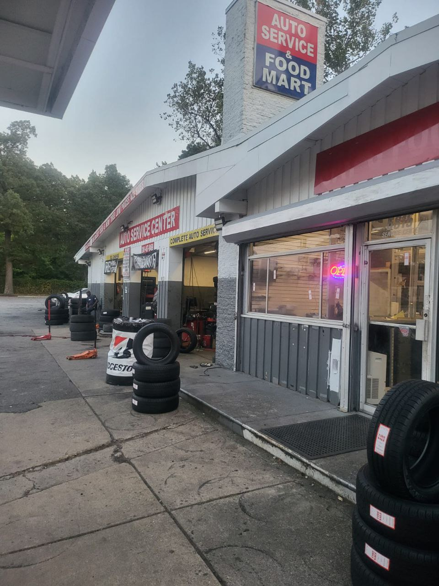

# 🚗 Bamboo Tire Shop

A modern, responsive tire shop website built with Next.js, featuring comprehensive mobile optimization and enhanced video player functionality.



## ✨ Features

- 📱 **Mobile-First Design** - Fully responsive across all devices with touch-optimized interactions
- 🎥 **Custom Video Player** - Enhanced video controls with mobile optimization and smooth playback
- ⚡ **Performance Optimized** - Fast loading, hardware acceleration, and smooth animations
- 🎨 **Modern UI/UX** - Glass morphism effects, smooth transitions, and intuitive design
- 🔍 **SEO Optimized** - Structured data, automatic sitemap, and comprehensive meta tags
- ♿ **Accessible** - WCAG compliant with proper ARIA labels and semantic HTML
- 🛠️ **Service Management** - Dynamic service cards with video demonstrations
- 📞 **Contact Integration** - Multiple contact methods with emergency services
- 🌟 **Customer Testimonials** - Social proof with animated testimonial carousel

## 🚀 Tech Stack

- **Framework**: Next.js 13+ with App Router
- **Language**: TypeScript for full type safety
- **Styling**: Tailwind CSS with custom animations
- **Animations**: Framer Motion for smooth interactions
- **Icons**: Lucide React for consistent iconography
- **Mobile**: Custom hooks and responsive design patterns
- **SEO**: Built-in optimization with structured data
- **Performance**: Optimized images, lazy loading, and code splitting

## 📱 Mobile Optimizations

### Touch Interactions

- ✅ Minimum 44px touch targets for all interactive elements
- ✅ Active state feedback with scale animations
- ✅ Touch manipulation CSS for better responsiveness
- ✅ Custom tap highlighting in brand colors

### Responsive Design

- ✅ Mobile-first approach with progressive enhancement
- ✅ Fluid typography scaling from mobile to desktop
- ✅ Adaptive spacing and padding for all screen sizes
- ✅ Optimized navigation with collapsible mobile menu

### Performance

- ✅ Hardware acceleration for smooth scrolling
- ✅ Optimized animations with reduced motion support
- ✅ Resource preloading for critical assets
- ✅ Touch device detection and optimization

## 🎥 Video Player Features

### Enhanced Controls

- ✅ Mobile-responsive control buttons with proper touch targets
- ✅ Custom progress bar with touch-friendly interaction
- ✅ Fullscreen support with proper mobile handling
- ✅ Mute/unmute with visual feedback

### Loading & Error States

- ✅ Smooth loading animations with timeout protection
- ✅ Graceful error handling with retry options
- ✅ Proper state management for play/pause/ended events
- ✅ Optimized for mobile video playback

## 🛠️ Getting Started

### Prerequisites

- Node.js 18+
- npm or yarn package manager

### Installation

1. **Clone the repository:**

```bash
git clone https://github.com/YOUR_USERNAME/bamboo-tire-shop.git
cd bamboo-tire-shop
```

2. **Install dependencies:**

```bash
npm install
# or
yarn install
```

3. **Run the development server:**

```bash
npm run dev
# or
yarn dev
```

4. **Open your browser:**
   Navigate to [http://localhost:3000](http://localhost:3000) to see the website.

## 📁 Project Structure

```
src/
├── app/                    # Next.js App Router
│   ├── about/             # About page with layout
│   ├── contact/           # Contact page with forms
│   ├── services/          # Services showcase
│   ├── layout.tsx         # Root layout with optimizations
│   ├── page.tsx           # Homepage
│   ├── sitemap.ts         # Auto-generated sitemap
│   ├── robots.ts          # SEO robots configuration
│   └── manifest.ts        # PWA manifest
├── components/            # Reusable components
│   ├── ui/               # Core UI components
│   │   ├── CustomVideoPlayer.tsx
│   │   └── button.tsx
│   ├── optimization/     # Performance components
│   │   └── MobileOptimizer.tsx
│   ├── seo/             # SEO components
│   │   └── StructuredData.tsx
│   └── buttons/         # Interactive elements
├── containers/           # Layout containers
│   └── layout/          # Page sections
├── lib/                 # Utilities and hooks
│   ├── hooks/           # Custom React hooks
│   │   ├── use-mobile.tsx
│   │   └── use-theme.tsx
│   └── content/         # Content management
└── styles/              # Global styles and CSS
```

## 🎨 Key Components

### MobileOptimizer

Runtime mobile optimizations including:

- Touch device detection
- Mobile-specific CSS injection
- Performance optimizations
- Resource preloading

### CustomVideoPlayer

Enhanced video player with:

- Mobile-first controls
- Touch-friendly interactions
- Proper loading states
- Error handling and recovery

### useMobile Hook

Comprehensive mobile detection:

- Device type detection (mobile/tablet/desktop)
- Touch capability detection
- Screen size and orientation tracking
- Real-time responsive updates

## 🔧 Configuration

### Environment Variables

Create a `.env.local` file for local development:

```env
NEXT_PUBLIC_SITE_URL=http://localhost:3000
NEXT_PUBLIC_CONTACT_EMAIL=your-email@example.com
NEXT_PUBLIC_PHONE_NUMBER=+1234567890
```

### Customization

- **Colors**: Update `tailwind.config.js` for brand colors
- **Content**: Modify `src/lib/content/portfolio.ts` for business information
- **Services**: Update service data in `src/app/services/page.tsx`
- **Images**: Replace images in `public/` directory

## 🚀 Deployment

### Vercel (Recommended)

1. Push code to GitHub
2. Connect repository to Vercel
3. Deploy with zero configuration

### Other Platforms

- **Netlify**: Drag and drop build folder
- **AWS Amplify**: Connect GitHub repository
- **GitHub Pages**: Use `next export` for static deployment

### Build Commands

```bash
# Production build
npm run build

# Start production server
npm start

# Export static site
npm run export
```

## 📊 Performance Features

- ⚡ **Core Web Vitals** optimized
- 🖼️ **Image optimization** with Next.js Image component
- 📦 **Code splitting** for faster loading
- 🔄 **Lazy loading** for non-critical resources
- 📱 **Mobile performance** prioritized
- 🎯 **SEO score** 95+ on Lighthouse

## 🤝 Contributing

1. Fork the repository
2. Create a feature branch (`git checkout -b feature/amazing-feature`)
3. Commit your changes (`git commit -m 'Add amazing feature'`)
4. Push to the branch (`git push origin feature/amazing-feature`)
5. Open a Pull Request

### Development Guidelines

- Follow TypeScript best practices
- Maintain mobile-first approach
- Test on multiple devices
- Ensure accessibility compliance
- Update documentation for new features

## 📄 License

This project is licensed under the MIT License - see the [LICENSE](LICENSE) file for details.

## 📞 Contact & Support

**Bamboo Tire Shop**

- 📱 **Phone**: (555) 123-4567
- 📧 **Email**: info@bambootires.com
- 🌐 **Website**: [bambootires.com](https://bambootires.com)
- 📍 **Address**: 123 Tire Street, Auto City, AC 12345

### Emergency Services

Available 24/7 for roadside assistance and emergency tire services.

---

**Built with ❤️ using Next.js and modern web technologies**

_Professional tire services with mobile-optimized customer experience_
